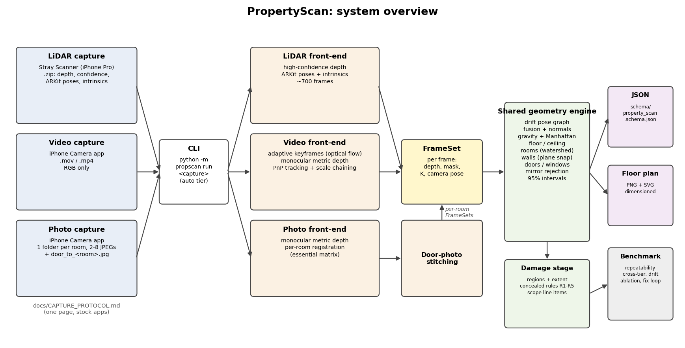
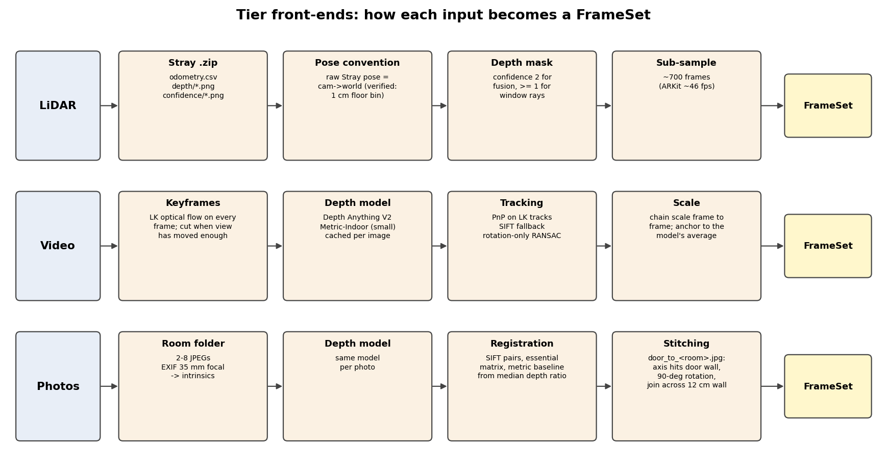
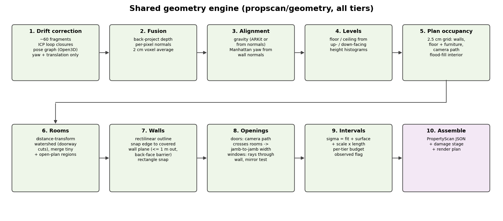
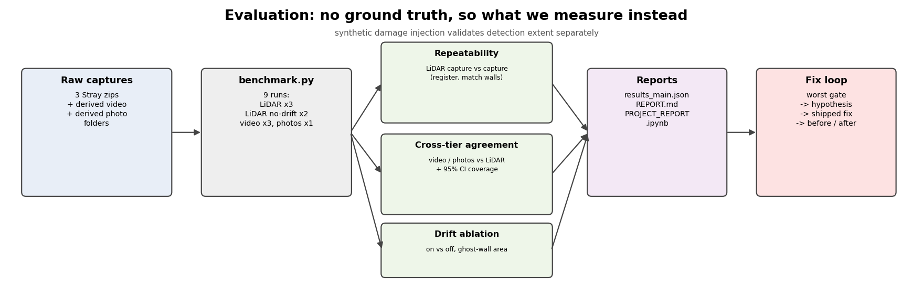

# PropertyScan: phone capture to a dimensioned whole-property floor plan

> **Reviewers: start with [PROJECT_REPORT.ipynb](PROJECT_REPORT.ipynb).** It's a full walkthrough of what was built, the measured results with plans, the fix loop, what isn't done and why (including the no-iPhone hardware constraint), and defence notes. No code reading needed.

One command per capture, three input tiers, one output contract:

```
python -m propscan run <capture> -o out/
```

| `<capture>` | Tier | Example |
|---|---|---|
| Stray Scanner `.zip` (or extracted folder) | **LiDAR**: depth, ARKit poses, intrinsics | `sample data/single_room.zip` |
| `.mov` / `.mp4` walkthrough | **Video**: RGB only | `walk.mov` |
| Folder of per-room photo folders | **Photos**: 2–8 stills per room, no depth or poses | `my_flat/` |

Outputs `out/<id>.json` (schema: [schema/property_scan.schema.json](schema/property_scan.schema.json)) and `out/<id>_plan.png` / `.svg`:
- per-room walls, ceiling height, floor area and openings, all dimensioned;
- the stitched multi-room plan with adjacency;
- damage regions with class and metric extent, concealed-damage flags with the rule that fired, and scope line items keyed to surface IDs;
- a 95% interval on every measurement.

## System and pipeline



Each capture type is first reduced to the same intermediate: a **FrameSet** (metric depth + camera pose per frame). One shared geometry engine then turns any FrameSet into the plan.

```mermaid
flowchart LR
    subgraph Capture["Capture (stock apps, docs/CAPTURE_PROTOCOL.md)"]
        A1["LiDAR<br/>Stray Scanner .zip"]
        A2["Video<br/>Camera app .mov/.mp4"]
        A3["Photos<br/>1 folder per room<br/>+ door_to_room.jpg"]
    end
    CLI["python -m propscan run<br/>(auto tier detect)"]
    subgraph Tiers["Tier front-ends"]
        T1["LiDAR: confident depth<br/>+ ARKit poses"]
        T2["Video: adaptive keyframes<br/>mono depth, PnP tracking<br/>scale chaining"]
        T3["Photos: mono depth<br/>essential-matrix registration"]
        ST["Door-photo stitching"]
    end
    FS["FrameSet<br/>depth, mask, K, pose"]
    subgraph Engine["Shared geometry engine"]
        E1["Drift pose graph"] --> E2["Fusion + normals"] --> E3["Gravity + Manhattan"] --> E4["Floor / ceiling"]
        E4 --> E5["Rooms (watershed)"] --> E6["Walls (plane snap)"] --> E7["Doors / windows<br/>mirror rejection"] --> E8["95% intervals"]
    end
    DMG["Damage + concealed rules<br/>+ scope line items"]
    OUT1["JSON (published schema)"]
    OUT2["Floor plan PNG / SVG"]
    A1 & A2 & A3 --> CLI
    CLI --> T1 & T2 & T3
    T1 --> FS
    T2 --> FS
    T3 --> ST --> FS
    FS --> E1
    E8 --> DMG --> OUT1
    E8 --> OUT2
```



<details><summary>More diagrams: tier front-ends, geometry engine, evaluation</summary>







</details>

Diagrams are regenerated by `python scripts/make_diagrams.py`.

How to capture: **[docs/CAPTURE_PROTOCOL.md](docs/CAPTURE_PROTOCOL.md)** (one page, stock apps). Which tier runs on which phone: [docs/DEVICE_MATRIX.md](docs/DEVICE_MATRIX.md).

## From a clean machine to a first result (≈10 min)
Requires Python 3.10–3.12 (tested on 3.11, Windows 11; pure-pip, no compiler needed).
```bash
git clone <repo> propscan && cd propscan
python -m venv .venv && . .venv/bin/activate      # Windows: .venv\Scripts\activate
pip install -r requirements.txt                   # torch CPU wheel is the big one
python scripts/fetch_weights.py                   # ~100 MB, Depth Anything V2 Metric-Indoor Small
python -m propscan run "sample data/single_room.zip" -o out/
```
Put the provided sample captures in `sample data/` (they are not in git; see [data/README.md](data/README.md)).

Timing on a 12-thread laptop CPU with no GPU:

| Tier | Time per capture |
|---|---|
| LiDAR | 1.5–4 min per capture (most of it drift correction) |
| Video | about 1.3 s per keyframe for the depth model; cached after the first run |
| Photos | about 2 s per photo |

A CUDA build of torch is used automatically if present.

## Reproduce every reported number
```bash
python scripts/benchmark.py                 # runs all captures and tiers, then scores -> benchmark/results_main.json
python scripts/make_photo_benchmark.py "sample data/single_scan_with_ceiling.zip" data/photos/with_ceiling
python scripts/fixloop_eval.py --evidence   # fix-loop before/after (see docs/FIX_LOOP.md)
python scripts/synthetic_damage_test.py "sample data/single_room.zip"
```
Monocular-depth outputs are cached in `.cache/depth` (keyed by image content and model) and replay deterministically. Delete `.cache/` to exercise the live path.

## Layout
```
propscan/io/stray.py          Stray Scanner loader (pose convention verified on data)
propscan/tiers/{lidar,video,photos}.py   tier front-ends -> FrameSet (depth + pose per frame)
propscan/geometry/frames.py   back-projection, normals, voxel fusion
propscan/geometry/drift.py    fragment pose graph + ICP loop closures (drift correction)
propscan/geometry/align.py    gravity + Manhattan alignment
propscan/geometry/plan.py     rooms, walls, ceiling, openings (shared by all tiers)
propscan/damage/detect.py     damage regions, concealed-damage rules, scope items
propscan/uncertainty.py       per-tier error budget -> 95% intervals
propscan/schema.py            output contract (pydantic -> JSON schema)
scripts/                      benchmark, fix loop, photo-set builder, diagnostics
docs/                         protocol, device matrix, technical report, fix loop, compliance matrix
```

Docs: [Technical report](docs/TECHNICAL_REPORT.md) · [Compliance matrix](docs/COMPLIANCE.md) · [Benchmark report](benchmark/REPORT.md) · [Fix loop](docs/FIX_LOOP.md) · [Models disclosure](docs/MODELS.md)
